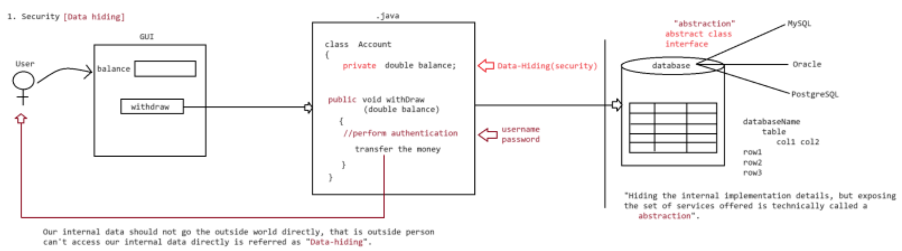
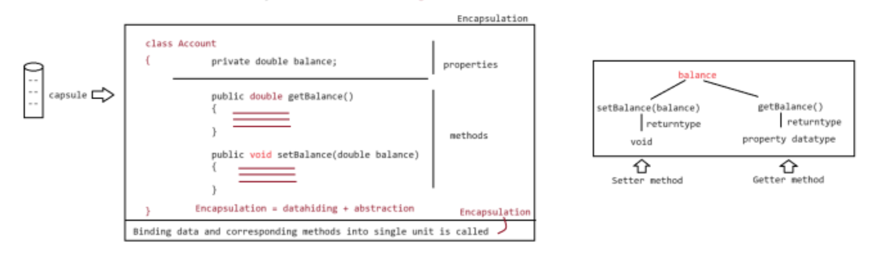
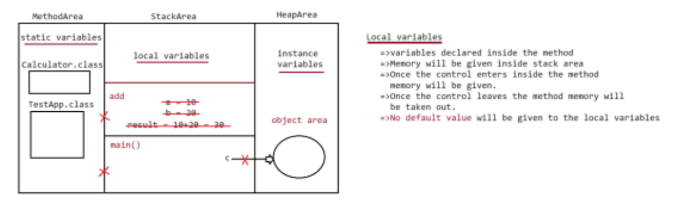
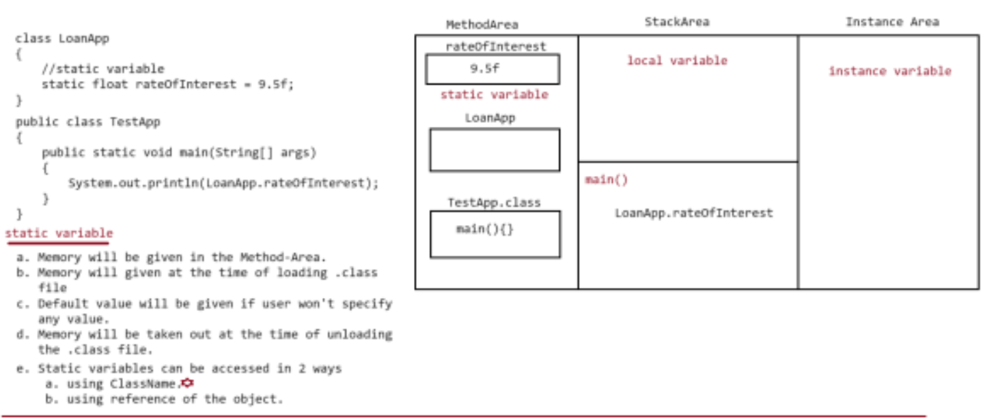
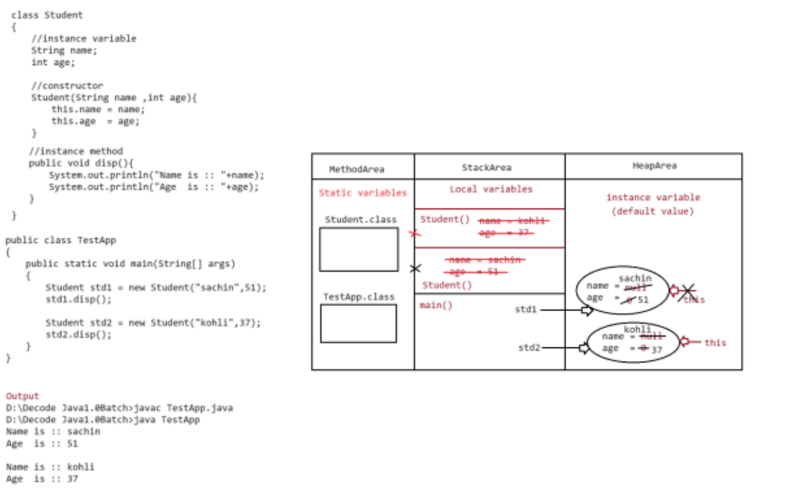
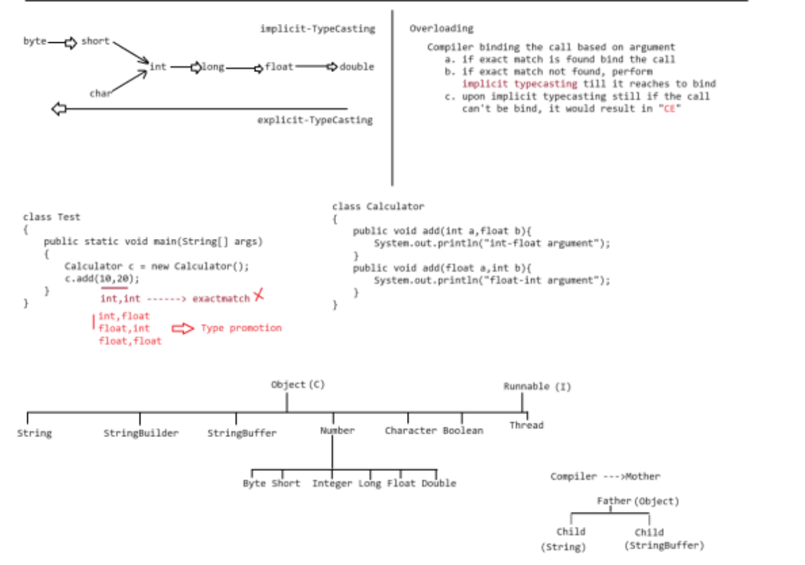

### Java Theory

----

## Object Oriented Programming (OOPs)

----

### OOPS Day-1
- OOPS is a programming paradigm that uses objects to represent real-world entities and their interactions. 
- It is a way of programming that is based on the concept of classes and objects.

## Data-Hiding
Our internal data should not go to the outside world directly, 
that is outside person can't access our internal data directly is called **Data-Hiding**.

## Abstraction 
Hiding the internal implementation details, but exposing the set of services offered is technically called **Abstraction**.

## Encapsulation
Binding the data and the corresponding methods into a single unit is called **Encapsulation**.

## Getter and Setter
A getter is a method that returns the value of a property, and a setter is a method that sets the value of a property.

**Example :**
```java
public class BankAccount {
    private double balance;
    
    public double getBalance() {
        return balance;
    }
    
    public void setBalance(double balance) {
        this.balance = balance;
    }
}
```

1. Withdrawing the money from the ATM to understand the Data-Hiding, Abstraction.


2. Encapsulation of the Bank Account.


----

### OOPS Day-2

## Inheritance 
- The process of acquiring the properties and behaviours of one class to the another class is called **Inheritance**.

- In java, inheritance can be achieved in 2 forms.
    - IS - A (using extends keyword)
    - HAS - A (Declaring one ref variable inside another class)

- => The class which shares the properties and behaviours to another class is referred to as the **Base class/Super class/ Parent class**.
- => The class which uses the properties and behaviours of the base class is referred to as the **Derived class/Child class/Sub class**.

**Example :**
```java
class Person {
    public String name;
    public String address;
    public int age;
}
class Student extends Person {
    public int marks;
    public String grade;
}
```

## Constructor
- **Constructor** is a method, which has got the same name as that of className.
- While writing the constructor, we should not keep the return type for the method.
- Constructor gets called automatically at the time of object creation.
- Since the contructor gets called automatically at the time of object creation, we use this constructor to initialize the instance variables of the class.

**How many types of constructors are there in Java?**
- There are two types of constructors in Java.
    - Default Constructor 
    - Parameterized Constructor 

**Example :**
```java
package coding.OOPS_2;

class Employee {
    public String name;
    public int age;

    Employee() {
        System.out.println("Default Constructor");
    }
    Employee(String name, int age) {
        this.name = name;
        this.age = age;
        System.out.println("Parameterized Constructor");
    }
    public void display() {
        System.out.println("Name : " + this.name);
        System.out.println("Age : " + this.age);
    }
}

public class Test2 {
    public static void main(String[] args) {
        Employee emp = new Employee();
        emp.display();
        Employee e = new Employee("Ambadas", 21);
        e.display();
    }
}
PS D:\Practice Examples\Java> java coding/OOPS_2/Test2       
Default Constructor
Name : null
Age : 0
Parameterized Constructor
Name : Ambadas
Age : 21
PS D:\Practice Examples\Java> 

```
## Types of Variables
In java, depending upon the position of declaration and its behaviour we have 3 types of variables.

1. Local Variable - variable declared inside a method are local
2. Instance Variable - variables declared inside the class but outside the method
3. Static Variable - variables declared inside the class and outside the method with static keyword

## Local Variable
- Local variable is a variable that is declared inside a method.
- Memory will be given inside the stack area.
- Once the control enters inside the method memory will be allocated to the variable.
- Once the control leaves the method the memory will be freed.
- No default value is given to the variable.

**Example :**
```java
class Calculator {
    // Local Variable are a, b, result
    public void add(int a, int b) {
        int result =  a + b;
        System.out.println(result);
    }
}

public class Test3 {
    public static void main(String[] args) {
        Calculator c = new Calculator();
        c.add(10, 20);
    }
}
```


---

## Static Variable
- Memory will be given in the Method-Area.
- Memory will given at the time of loading .class file
- Default value will be given if user won't specify any value.
- Memory will be taken out at the time of unloading the .class file.
- Static variables can be accessed in 2 ways
    - using ClassName.
    - using reference of the object.

**Example :**
```java
class LoanApp {
    static float rateOfInterest = 0.05f;

}
public class Test4 {
    public static void main(String[] args) {
        System.out.println(LoanApp.rateOfInterest);
        System.out.println(new LoanApp().rateOfInterest);
    }
}
```


---

## Instance Variable
- Memory will given in heap area.
- Default value depending on datatypes.
- Memory initialized at the time of object creation.
- Memory will be freed at the time of object destruction.

**Example :**
```java
class Student {
    String name;
    int age;
    Student(String name, int age) {
        this.name = name;
        this.age = age;
    }
    public void display() {
        System.out.println("Name : " + this.name);
        System.out.println("Age : " + this.age);
    }
}
public class Test5 {
    public static void main(String[] args) {
        Student s1 = new Student("Ambadas", 21);
        s1.display();
        Student s2 = new Student("John", 22);
        s2.display();
    }
}
```


---

## Ploymorphism 
  - Ploy  ==> Many
  - Morphism ==> Forms

1. Static Ploymorphism (Complie Time Polymorphism)
    - eg : Method Overriding, Method Hiding
2. Dynamic Ploymorphism (Run Time Polymorphism)
    - eg : Method Overloading

---

## 1. Static Ploymorphism (Complie Time Polymorphism)

## Method Overloding
- Methods with same name and different parameter type or count is called **Method Overloading**.
- In case of method overloaing, the complier will bind the call of the method to the body of method.
- JVM will just execute the method body, so we can say method overloading as **Complie Time Binding/Early Binding**.
 
 ```java
 class Demo {
    public void add(int a, int b) {
        System.out.println("int-int parameter");
    }
    public void add(float a, float b) {
        System.out.println("float-float parameter");
    }
    public void add(double a, double b) {
        System.out.println("double-double parameter");
    }
}
public class Test {
    public static void main(String[] args) {
        Demo d = new Demo();
        d.add(10,20); // int-int parameter
        d.add(10.0,20.0); // double-double parameter
        d.add(10.0f,20.0f); // float-float parameter
    }
}
Output :
PS D:\Practice Examples\Java\coding\OOPS_3> javac Test.java
PS D:\Practice Examples\Java\coding\OOPS_3> java Test
int-int parameter
double-double parameter
float-float parameter

```
## Var-args in java
- This mechanism is available in java from JDK1.5V
- In case of var-args all the arugments should be of same datatype
- U can call var-args by passing arguments from 0....n
```java
class AdvancedCalculator{
//Var-Args:: 0 to n
public void add(int... args){
    int sum = 0;

    for (int data : args )
    {
    sum+=data;
    }
    System.out.println(sum);
    }
}
class Test {
    public static void main(String[] args) {
        AdvancedCalculator ac = new AdvancedCalculator();
        ac.add();
        ac.add(10);
        ac.add(10,20);
        ac.add(10,20,30);
        ac.add(10,20,30,40);
        ac.add(10,20,30,40,50);
    }
}
```



---

## 2. Dynamic Ploymorphism (Run Time Polymorphism)

## Method Overriding
- During inheritance, the parent class method implementation would not match the needs of the child class 
 so, the child class takes the methods name, but it will change the implementation as per the needs of the child class.
 This is called **Method Overriding**.

- In case of overriding, JVM will bind the calls based on the runtime object, but not on the reference of object 
  so, we can say Method Overriding as **True Polymorphism/ Late Binding/ Run Time Binding**.

```java
package coding.OOPS_4;

class Parent {
    public void property() {
        System.out.println("Land + Cash + Gold");
    }

    public void marry() {
        System.out.println("Relative Girl");
    }
}

class Child extends Parent {
    public void property() {
        System.out.println("Land + Cash + Gold");
    }
    public void marry() {
        // Re-implementation of the method
        System.out.println("Some Other Girl");
    }
}
public class Test {
    public static void main(String[] args) {
        Parent p = new Parent();
        p.property(); // Land + Cash + Gold
        p.marry(); // Relative Girl

        Child c = new Child();
        c.property(); // Land + Cash + Gold
        c.marry(); // Some Other Girl
       
        Parent pa = new Child();
        pa.property(); // Land + Cash + Gold
        pa.marry(); // Some Other Girl

        // Complier will throw error : incompatible types if we type cast then runtime error java.lang.ClassCastException
        // Child ch = (Child) new Parent();
        // ch.property();
        // ch.marry();
    }
}
```

**Rules of Overriding :**

1. Return Type Rule
- While overriding, we cannot change the return type of the method.
- Changing return type is allowed only if there is a relationship between return types (covariant return types).

2. Access Modifier Rule
- While overriding, we cannot reduce the scope of the access modifier.
- Order of scope:
    private < default < protected < public
- Increasing the scope is allowed.

3. Private Method Rule
- private methods do not participate in inheritance.
- Therefore, overriding private methods is not possible.

4. Final Method Rule
- A method declared as final cannot be overridden in the child class.
- final keyword usage:
    - Variable → value cannot be changed
    - Method → cannot be overridden
    - Class → cannot be inherited

5. Abstract Method Rule
- If a parent class contains abstract methods, the child class must provide implementation for all of them.
- If the child class does not provide implementation, then the child class must be declared abstract.

---
